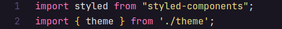
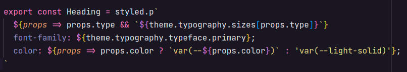
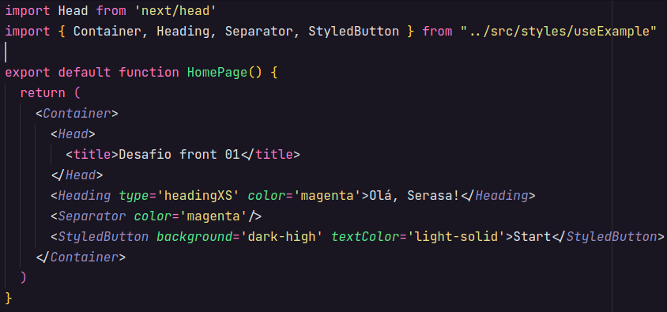

## Como instalar

```bash
# Clone este repositório
$ git clone https://github.com/EdsonLucasbd/desafio-front.git

# Acesse a pasta do projeto no seu terminal
$ cd 1-ECERCISE

# Instale as dependências
$ yarn

# Execute a aplicação em modo de desenvolvimento
$ yarn dev

# A aplicação abrirá na porta:3000
```

## Como foi estruturada a componentização:
Para esse exercício utilizei a biblioteca styled components, primeiro defini os estilos globais e as variáveis para cores como solicitado no arquivo **Cores.jpg**, essas configurações podem ser vistas em [globals.js](src/styles/globals.js).

Em seguida, de acordo com as intruções passadas criei o arquivo de temas [theme.js](src/styles/theme.js), nele consta um objeto contendo a paleta de cores e a tipografia solicitada, assim como os breakpoints.

## Como usar:
E finalmente chegamos ao momento da utilização, como estamos usando styled components, criamos um arquivo javascript, como exemplo criei o arquivo [useExample.js](src/styles/useExample.js), feito isso importamos nesse arquivo o `styled` do styled components e o objeto de temas que criamos em [theme.js](src/styles/theme.js) para que possamos utilizar nos nossos componentes.


Agora já podemos dar inicio à criação dos nossos componentes, criei os componentes Container, Heading, Separator e StyledButton para demonstração. A utilização da tipografia se dá através do objeto theme que importamos já a paleta de cores podemos usar as variáveis definidas no arquivo [globals.js](src/styles/globals.js), a utilização segue segue o seguinte padrão:
- Para as cores:   
    `color: var(--NOME_DA_VARIAVEL_DE_COR)`

- Para a tipografia:  
    - Como theme é um objeto, utilizamos a notação de ponto para acessar suas propriedades:   
    `${theme.typography.sizes.display}`

Como é interessante que os valores possam ser definidos dinamicamente podemos pegar a informação do valor desejado através das props, como no exemplo do componente **Heading**:


Nesse exemplo caso determinada propriedade seja definida o estilo correspondente definido no tema será aplicado, caso contrário será aplicado um estilo padrão, com excessão da propriedade **type** que caso não seja informada o componente irá ser representado como uma tag *p* normal.

Por fim utilização dos componentes criados fica como no seguinte exemplo do arquivo [index.js](pages/index.js):
